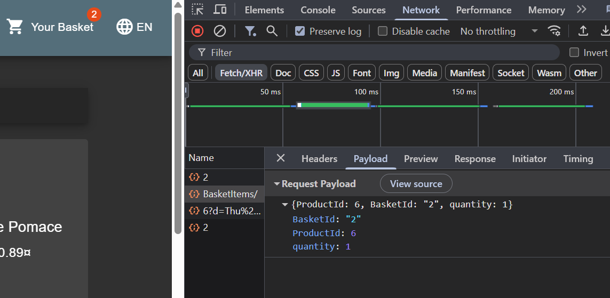
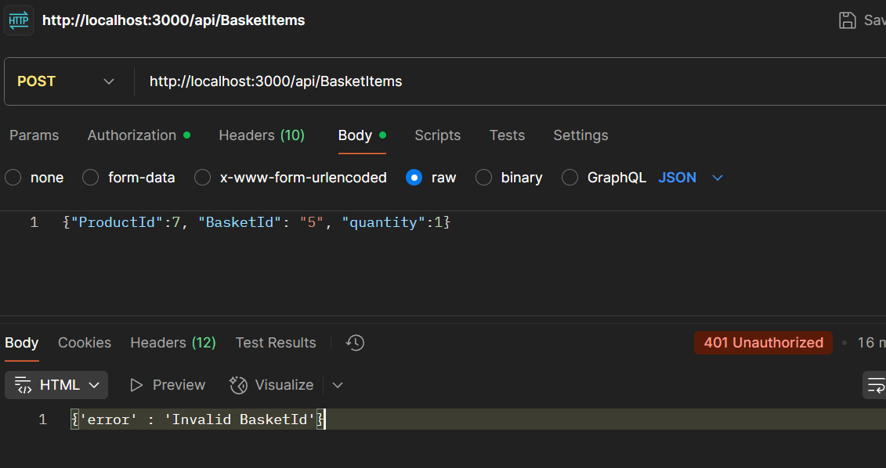
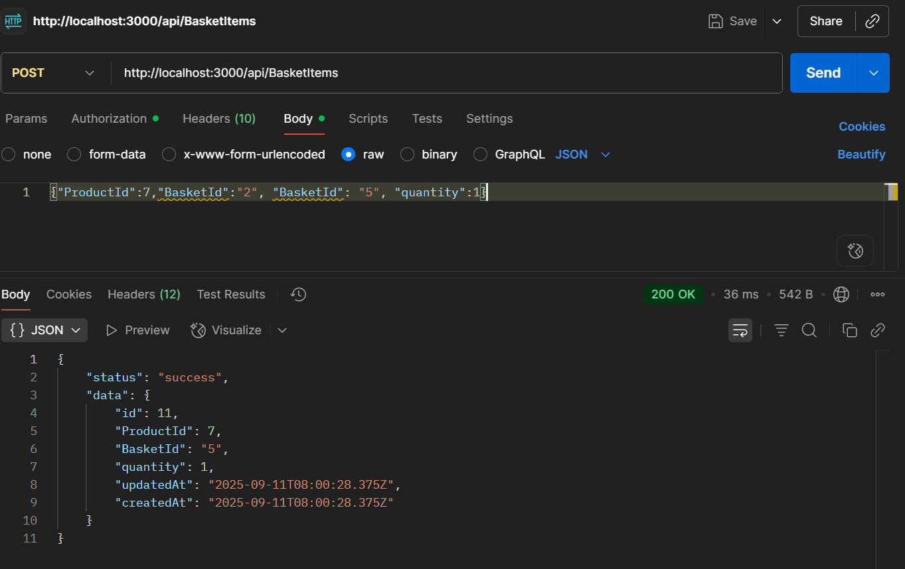
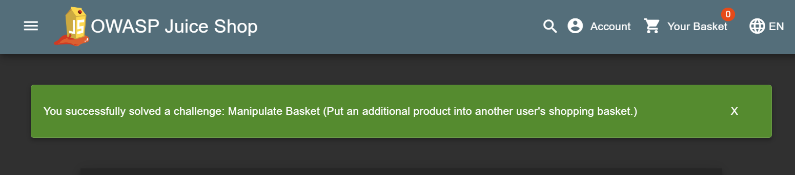

# Manipulate Basket OWASP Juice Shop

Broken Access Control - Manipulate Basket: 
Put an additional product into another user's shopping basket.

Link resource: https://github.com/juice-shop/juice-shop

# Solusi

langsung saja kita coba add item ke basket seperti user biasa, dan buka devtool

sudah jelas terlihat vulnerability dari endpoint tersebut adalah menerima payload `BasketId` untuk acuan dari target item ke basket yang mana. Karena itu kita bisa langsung saja coba di postman dengan bearer token Jim tetapi `BasketId` yang lain

ternyata tidak bisa, ternyata masih ada handling dari sisi servernya. Saya coba overload payloadnya dengan memberikan 2 field `BasketId`

dan ternyata berhasil, `BasketId` yang terambil yang `BasketId` kedua, yaitu `BasketId` yang semestinya bukan untuk user Jim

