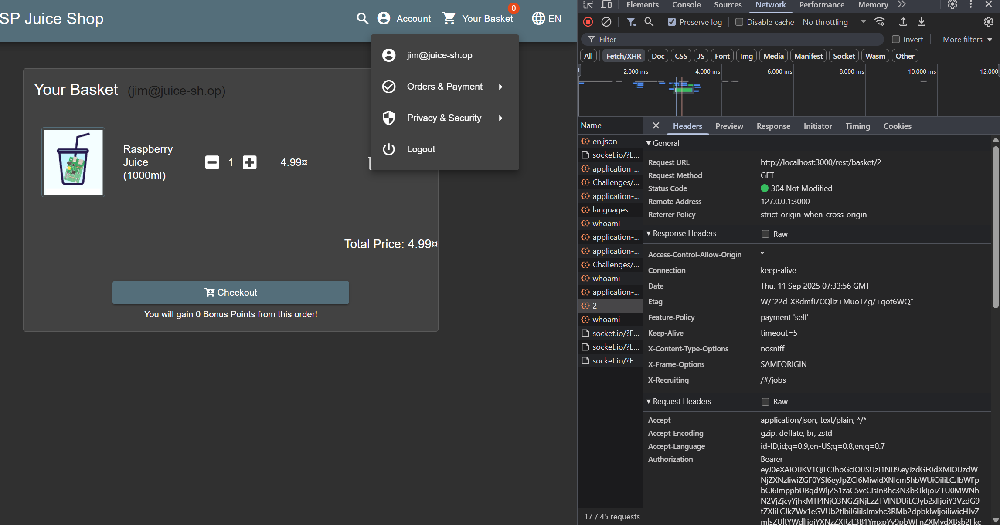
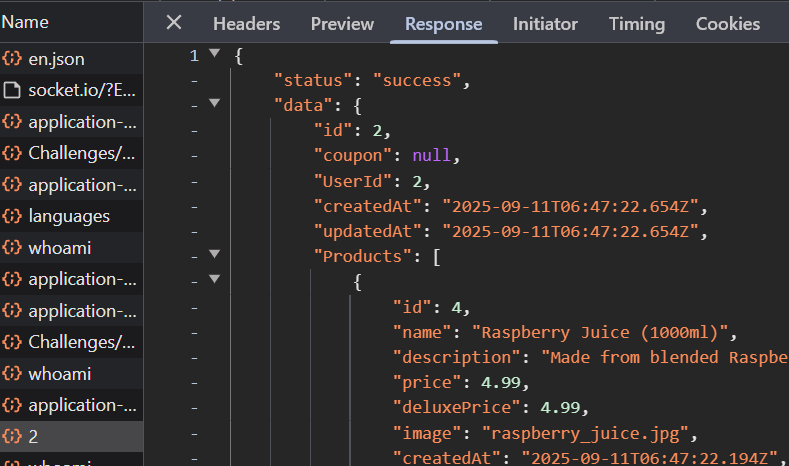
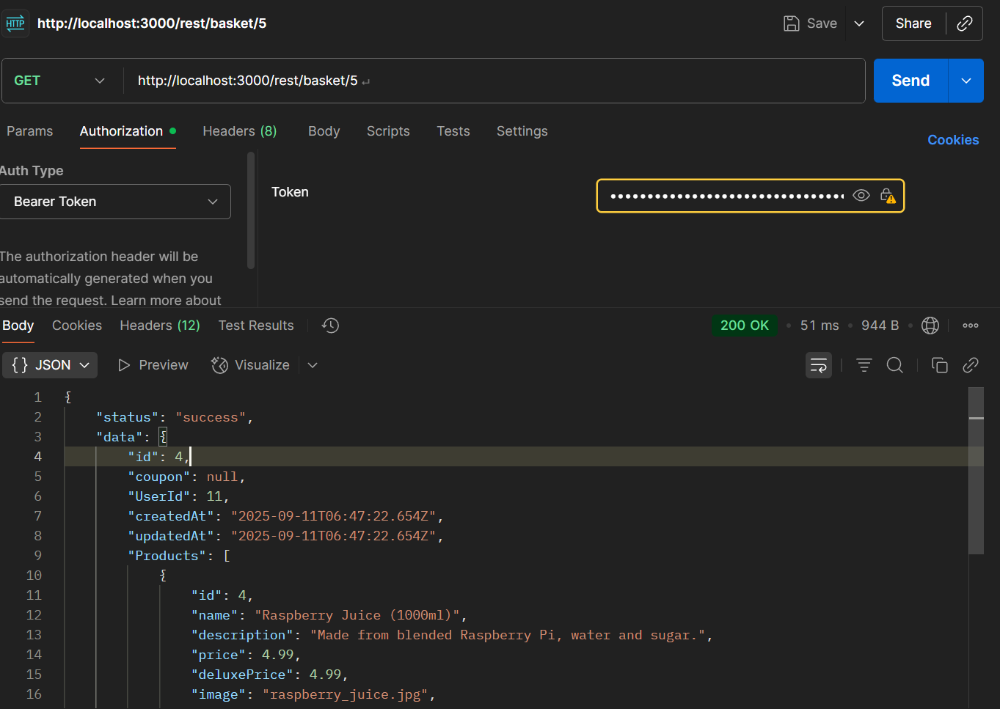
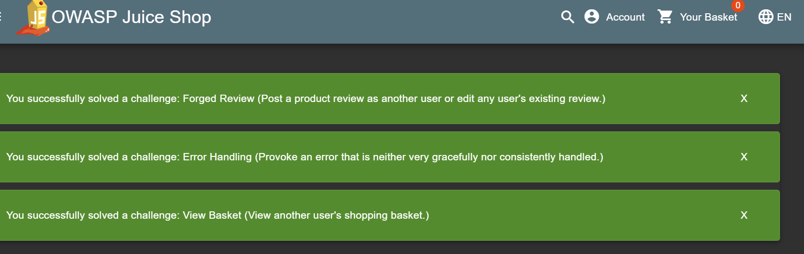

# View Basket OWASP Juice Shop

Broken Access Control - View Basket: 
View another user's shopping basket.

Link resource: https://github.com/juice-shop/juice-shop

# Solusi

Pertama2 kita coba lihat basket kita secara normal

dapat dilihat pada endpointnya terdapat path parameter pada endpoint basket, disitu terlihat angka 2. Dengan begitu kita asumsi bahwa identifier tersebut dapat diganti

dan benar saja, ternyata identifier `2` itu adalah basketId Jim. Dengan begitu kita bisa langsung coba saja pada postman untuk get endpoint tersebut dengan identifier yang lain tetapi menggunakan bearer tokennya jim

dan benar saja, kita bisa melihat basket / card user lain

