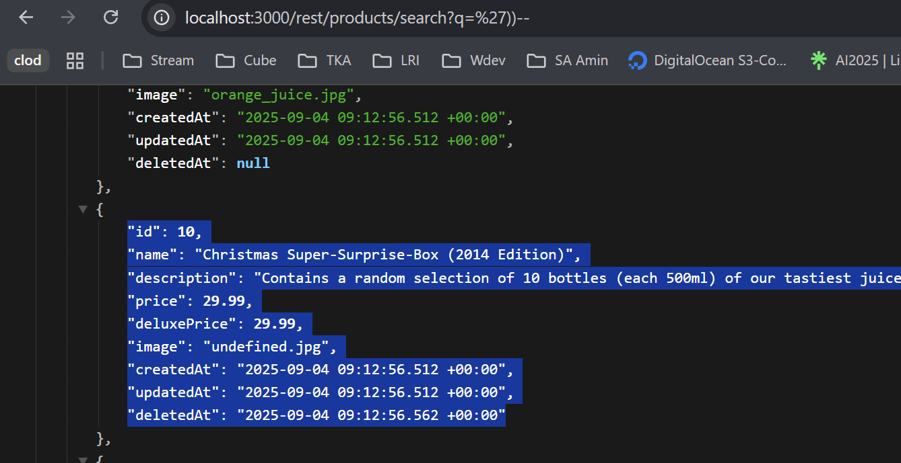
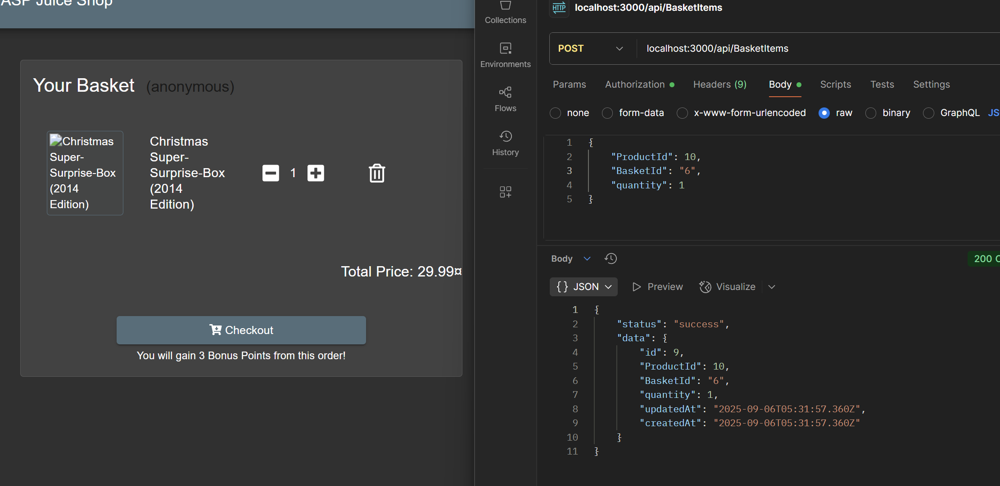

# Christmas Special OWASP Juice Shop

Link resource: https://demo.owasp-juice.shop/#/score-board?categories=Injection&showDisabledChallenges=false

Order the Christmas special offer of 2014.

## Solusi

Untuk challenge ini, langkah pertama kita perlu intercept request ke endpoint produk `/rest/products/search?q=` di sinilah parameter q dipakai untuk query search produk. Dari situ kita bisa coba suntikkan payload SQL langsung di parameter tersebut.

Kalau mau lebih cepat, sebenarnya kita juga bisa langsung akses URL ini lewat browser dengan menambahkan payload di bagian akhir endpoint, tanpa harus lewat intercept dulu.

Dari hasil injection tadi kita berhasil dapatkan id yang kita butuhkan, yaitu 10.
Langkah selanjutnya adalah intercept lagi request ketika kita menambahkan produk ke basket. Nah, di situ kita ubah parameter ProductId menjadi 10, sehingga yang masuk ke basket adalah Christmas Offer.

Dengan begitu kita bisa “paksa” produk tersembunyi tersebut untuk muncul di basket kita.

