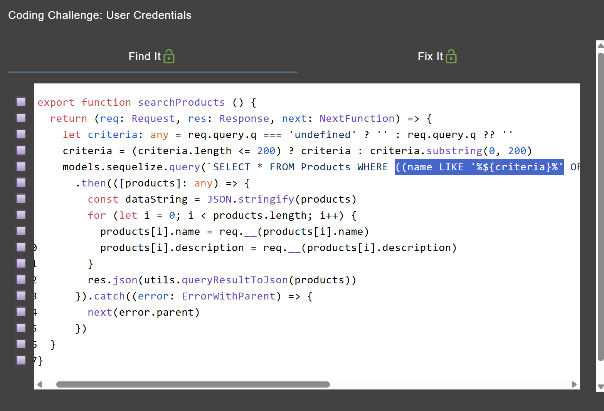

# Database Schema OWASP Juice Shop

Link resource: https://demo.owasp-juice.shop/#/score-board?categories=Injection&showDisabledChallenges=false

Exfiltrate the entire DB schema definition via SQL Injection.

## Solusi

Vulnerable source code:



Sama seperti chall lain pada kategori injection, endpoint yang digunakan adalah /rest/products/search?q=. Kali ini kita tidak mengambil data dari tabel users, tetapi dari sqlite_schema (pada SQLite) untuk melihat struktur database.

Langkah pertama, kita perlu menyesuaikan jumlah kolom yang sama dengan query asli menggunakan UNION SELECT. Setelah dicoba, jumlah kolom yang cocok adalah 9.

Payload dasar:

```sql
')) UNION SELECT 1,2,3,4,5,6,7,8,sql FROM sqlite_schema--
```

Dengan payload ini, isi dari kolom sql dalam tabel sqlite_schema akan ditampilkan pada hasil pencarian produk. Kolom sql berisi definisi tabel, kolom, dan constraint yang ada dalam database.


