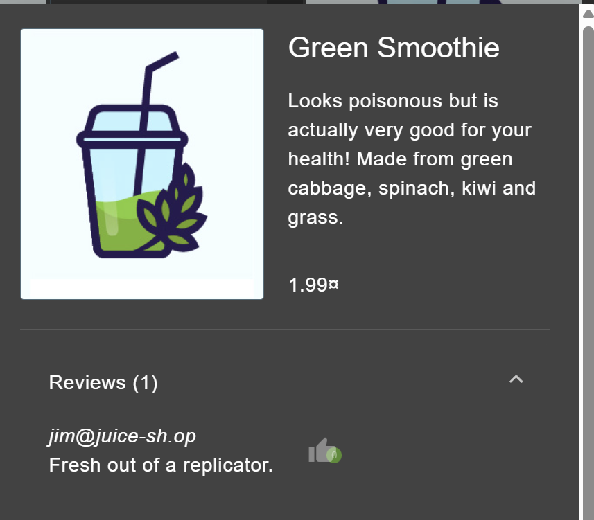
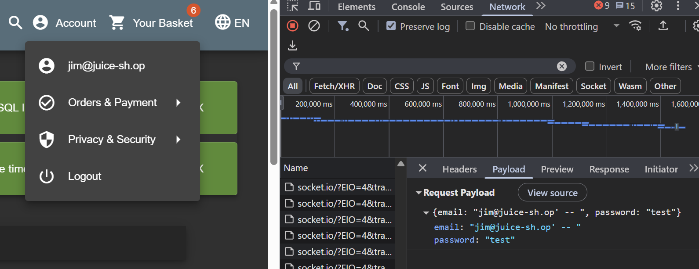

# Login Jim OWASP Juice Shop

Link resource: https://demo.owasp-juice.shop/#/score-board?categories=Injection

login to a specific user

## Solusi

Untuk masuk ke akun Jim, kita akan menggunakan SQLi lagi. Untuk itu, kita cukup menambahkan Jim di depan kueri. Untuk email Jim, kita akan cari tahu dari email di ulasan produk.



dari sini kita bisa langsung login menggunakan email jim dan ignore password dengan cara menambahkan karakter escape dan comment query pada akhir input email

kueri:

```sql
jim@juice-sh.op' --
```


