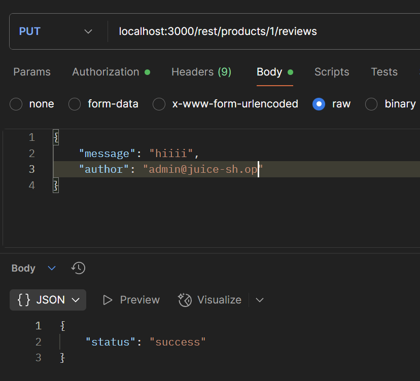
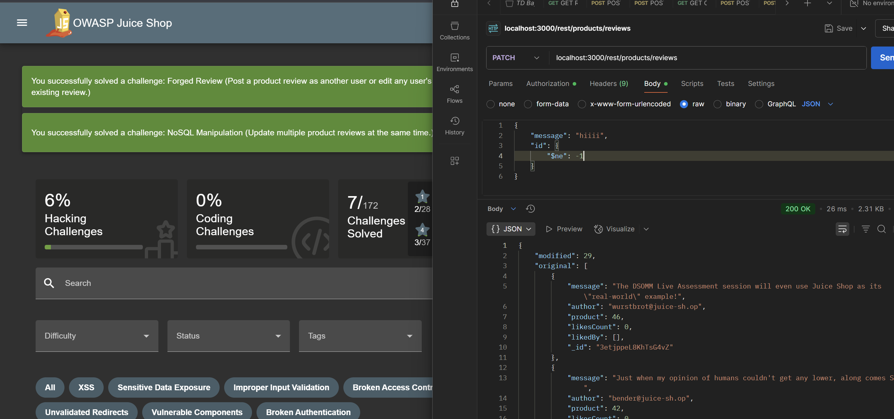

# NoSQL Manipulation OWASP Juice Shop

Link resource: https://demo.owasp-juice.shop/#/score-board?categories=Injection&showDisabledChallenges=false

Update multiple product reviews at the same time.

## Solusi

Di challenge ini kita diminta untuk memanipulasi semua product reviews sekaligus.
Hal ini bisa kita lakukan lewat satu endpoint, yaitu `/rest/products/reviews`. Di endpoint ini tersedia beberapa parameter yang bisa dimodifikasi. Dengan melakukan intercept pada request ke endpoint tersebut, kita bisa ubah isi dari field review (misalnya message, author, atau rating) sehingga perubahan tersebut berlaku untuk semua review produk sekaligus.

Request default-nya memang pakai PUT, tapi untuk bisa update review kita harus ganti metodenya jadi PATCH.
Lalu, di bagian parameter author kita ganti jadi ProductId. Nilainya kita set supaya tidak sama dengan -1.

Dengan trik ini, server akan menganggap semua produk valid, sehingga semua review bisa di-update atau dibuat ulang dengan pesan yang sama untuk seluruh produk.

