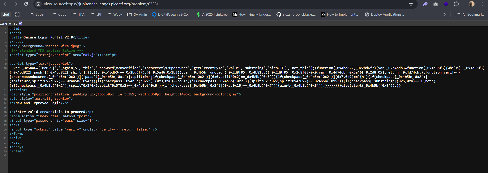
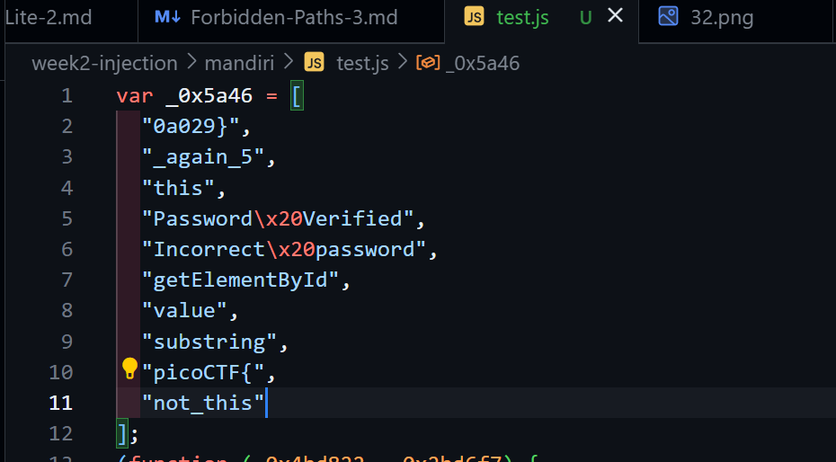

# Client Side Again picoCTF

Link referensi: https://play.picoctf.org/practice/challenge/69?category=1&page=5

Author: Danny

Description
Can you break into this super secure portal? https://jupiter.challenges.picoctf.org/problem/6353/ (link) or http://jupiter.challenges.picoctf.org:6353

# Solusi

didapatkan hint soal:

```
What is obfuscation?
```

kita langsung berasumsi untuk melihat kode source code dari web tersebut, karena obfuscation pada website identik dengan javascript yang diobfuscate:



lalu saya coba pastekan pada kode editor untuk membetulkan format line dari kode javascript tsb, dan didapatkan:



dari situ kita bisa langsung assembly flagnya yaitu:

```
picoCTF{not_this_again_50a029}
```
