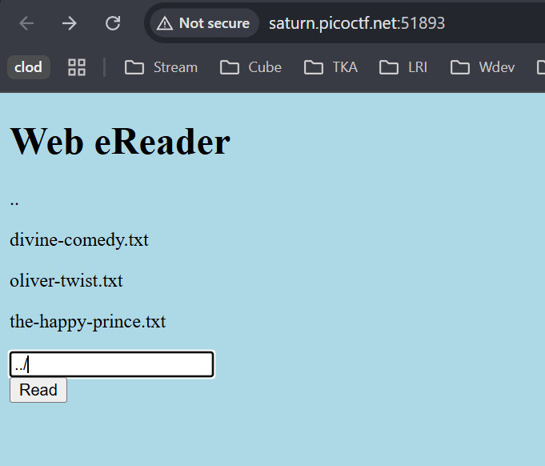
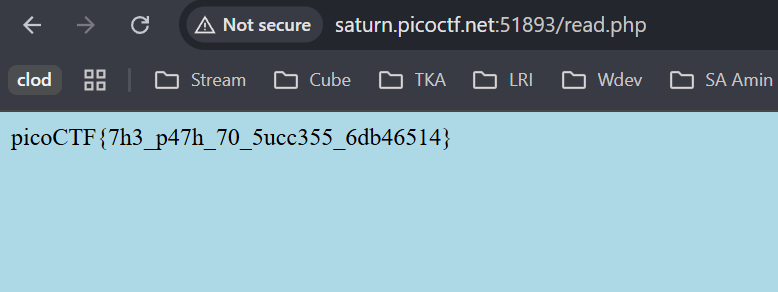

# Forbidden Paths picoCTF

Link referensi: https://play.picoctf.org/practice/

Author: LT 'syreal' Jones

Description
Can you get the flag?
We know that the website files live in /usr/share/nginx/html/ and the flag is at /flag.txt but the website is filtering absolute file paths. Can you get past the filter to read the flag?
Here's the website.

# Solusi

diberikan website yang diberi input yang mengasumsikan kita memberikan path file txt yang ingin dilihat isi konten teksnya



sesuai deskripsi pada soal, `pwd` atau current directory kita berada pada `/usr/share/nginx/html/` dan input memfilter absolute path. Dan juga diberi tahukan pada chall descnya bahwa flag ada di path root /flag.txt. Dengan begitu kita bisa memberikan path relative dengan cara keluar dari folder satu persatu sampai pada direktori yang sama dengan `flag.txt`nya. Atau sama dengan memberikan path relative flag.txt terhadap path sekarang kita. Dengan begitu kita bisa menginputkan:

```
../../../../flag.txt
```



dengan begitu dapatlah flagnya.
