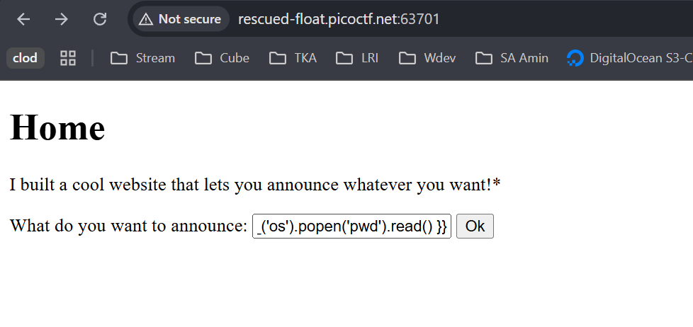
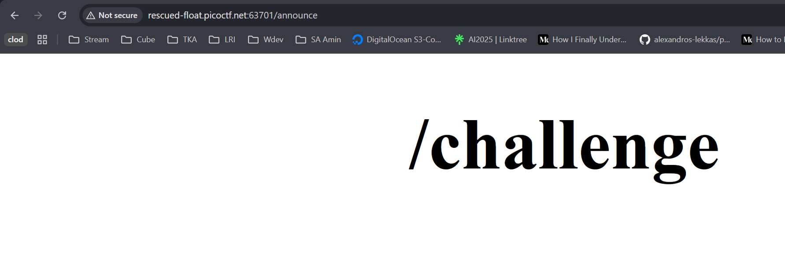
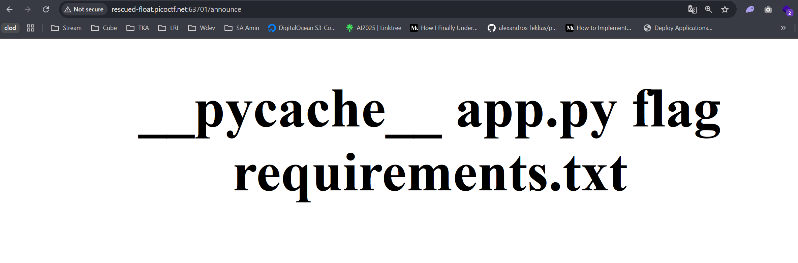
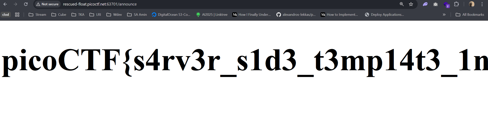

# SSTI1 Server Side Template Injection picoCTF

Link referensi: https://play.picoctf.org/practice/

Author: Venax

Description
I made a cool website where you can announce whatever you want! Try it out!
Additional details will be available after launching your challenge instance

# Solusi

Kita diberi sebuah input pada website yang merupakan server side template injection sesuai nama challnya, yang saya asumsikan pada umumnya aplikasi menggunakan template engine handlebars. Saya coba payload pertama yang menjalankan command import os dengan builtin function dan melakukan 'pwd'

```bash
{{ self.__init__.__globals__.__builtins__.__import__('os').popen('pwd').read() }}
```

hasilnya yaitu:




dan berhasil, dengan begitu saya langsung saja coba `ls` pada direktori sekarang dengan asumsi akan mendapatkan file flag pada direktori tersebut.



dengan begitu saya langsung saja coba lihat isi flag



dengan begitu selesailah chall ini dengan flag:

```
picoCTF{s4rv3r_s1d3_t3mp14t3_1nj3ct10n5_4r3_c001_9451989d}
```
