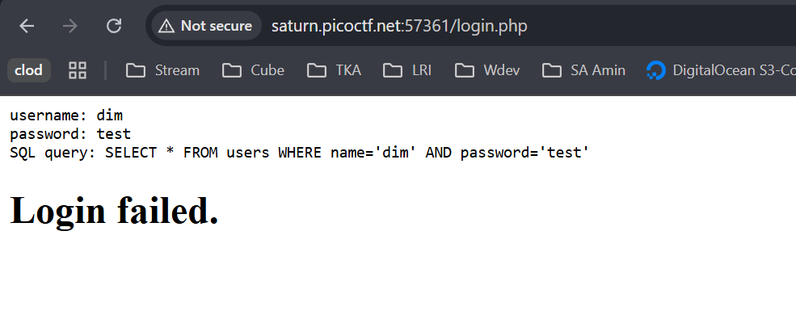
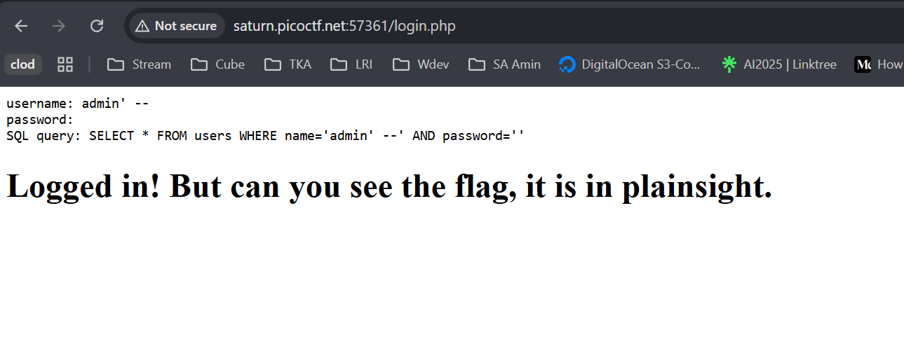
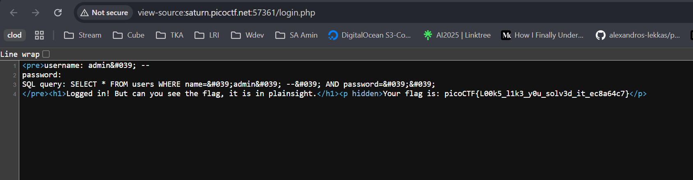

# SQLiLite picoCTF

Link referensi: https://play.picoctf.org/practice/

Author: Mubarak Mikail

Description
Can you login to this website?
Additional details will be available after launching your challenge instance

# Solusi

pertama2 saya mencoba mengisikan username dan password seperti login pada biasanya, ternyata website memberikan sql querynya



disini saya langsung berasumsi untuk mengisikan field username dengan admin dan menambahkan karakter `' --` untuk mengignore / komen query berikutnya:

dan benar saja kita berhasil login tetapi, flag tidak terlihat. dan dari teks response yang dihasilkan menunjukkan bahwa flag hidden / tidak terlihat



setelah itu saya coba inspect element / view source code dari page login yang berhasil tersebut.



lalu benar saja, flag tersedia:

```
picoCTF{L00k5_l1k3_y0u_solv3d_it_ec8a64c7}
```
