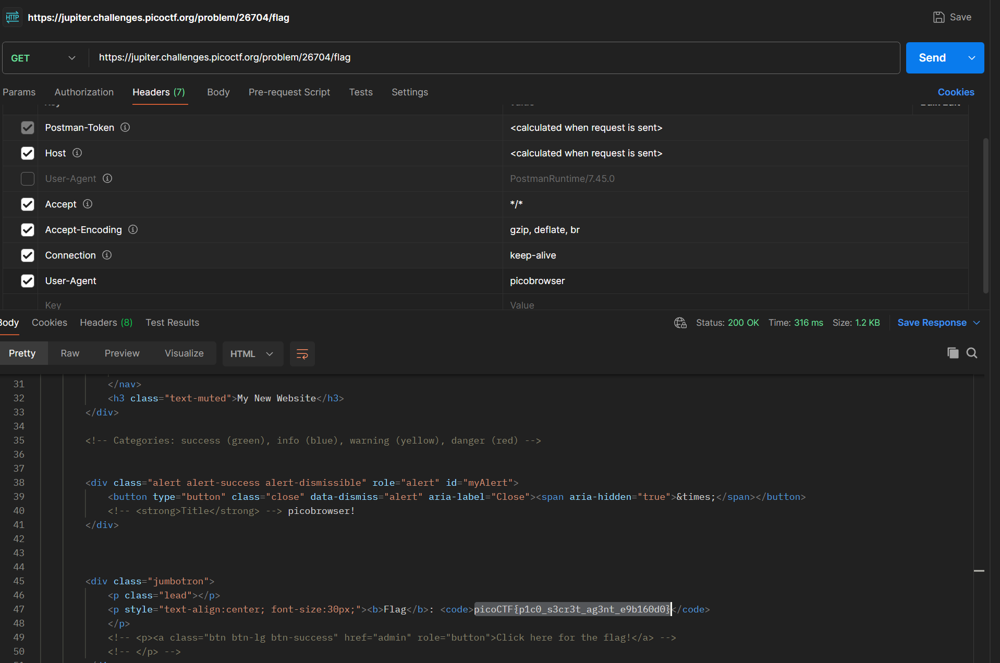

# picobrowser picoCTF

Link referensi: https://play.picoctf.org/practice/

Author: Archit

Description
This website can be rendered only by picobrowser, go and catch the flag! https://jupiter.challenges.picoctf.org/problem/26704/ (link) or http://jupiter.challenges.picoctf.org:26704

# Solusi

sesuai deskripsi pada soal, ini hanya perlu mengganti user-agent menjadi `picobrowser`, dengan begitu langsung mendapatkan flag secara mudah:



dapat dilihat saya mengoverride value `user-agent` dengan `picobrowser` dan langsung didapatkan flag pada response htmlnya:

```
picoCTF{p1c0_s3cr3t_ag3nt_e9b160d0}
```
